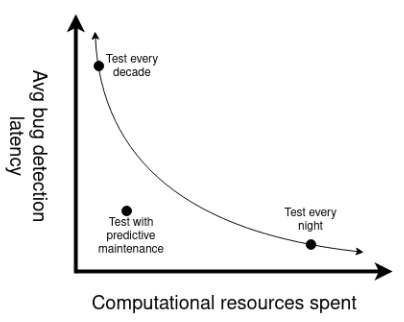

---
# See https://raw.githubusercontent.com/charmoniumQ/nix-documents/main/examples-src/markdown-bells-and-whistles/index.md
# Print LaTeX source when compile fail
# biblatex, natbib options
# template option
fail-if-warnings: yes
standalone: yes
dpi: 300
table-of-contents: no

cite-method: citeproc
bibliography: main.bib

# LaTeX options, see template.tex
title: Continuous testing to mitigate software collapse in scientific software
author:
  - name: Samuel Grayson
    department: Dept. of Computer Science
    affiliation: University of Illinois Urbana-Champaign
    location: Urbana, IL
    email: \href{https://orcid.org/0000-0001-5411-356X}{0000-0001-5411-356X}
  - name: Daniel S. Katz
    department: NCSA \& CS \& ECE \& iSchool
    affiliation: University of Illinois Urbana-Champaign
    email: \href{https://orcid.org/0000-0001-5934-7525}{0000-0001-5934-7525}
    location: Urbana, IL
  - name: Reed Milewicz
    department: Software Engineering and Research Dept.
    affiliation: Sandia National Laboratories
    email: \href{mailto:rmilewi@sandia.gov}{rmilewi@sandia.gov}
    location: Albuquerque, NM
  - name: Darko Marinov
    department: Dept. of Computer Science
    affiliation: University of Illinois Urbana-Champaign
    location: Urbana, IL
    email: \href{https://orcid.org/0000-0001-5023-3492}{0000-0001-5023-3492}
    # TODO: reformat department, affiliation, email, ORCId
classoption:
  - conference
fontsize: 10pt
papersize: letter
colorlinks: yes
linkcolor: blue
keywords:
  - reproducibility
  - software reliability
  - testing
numbersections: yes
lang: en
babel-lang: english
abstract: |
  Software tends to break or "collapse" over time, even if it is unchanged, due to non-obvious changes in the computational environment.
  Collapse in computational experiments undermines long-term credibility and hinders day-to-day operations.
  We propose to create the first public dataset of automatically executable scientific experiments.
  We explain how that data can be used to identify best practices, make continuous testing feasible, and repair broken programs.
  These techniques increase the reproducibility of computational experiments.
---

# Introduction

Software tends to break over time, even if it is unchanged, due to non-obvious changes in the computational environment.
This phenomenon is called "software collapse" [@hinsen_dealing_2019], because software with an unstable foundation is analogous to a building with an unstable foundation.
Software collapse is not a significant problem in some domains; it is acceptable if Google returns slightly different results one day to the next.
On the other hand,
in the scientific domain, software collapse could manifest as irreproducible or unreliable experiment[^irreproducible-term], which not only undermine long-term credibility of science but also hinder its day-to-day operations.

[^irreproducible-term]: In this article, we use Claerbout's terminology to define reproducibility [@claerbout_electronic_1992]:
one can execute the computational experiment in a different computational environment to get an approximately equivalent result.
Reproducibility is called "replicability" by some authors; see Plesser [@plesser_reproducibility_2018] for a discussion of terminology.
_Reliable_ computational experiment, on the other hand, we define here as whether the computational experiment terminates successfully in a different computational environment.
Reproducibility implies reliability, but not the other way around.
<!--
TODO: SAG: change this to use ACM terminology, repeatable.
-->

<!--
TODO: SAG: define bit-by-bit comparison, exact semantic comparison, approximate semantic comparison, and no-crash comparison. This study primarily deals with no-crash reproducibility and bit-by-bit repeatability, that is whether anyone can run the code without it crashing, and whether they can get identical results.
-->

1. **Undermines long-term credibility**: Computational experiments are widely used in many scientific disciplines.
  More than 90% of scientists surveyed across all fields use research software and 50% develop software for their research experiments [@hettrick_softwaresavedsoftware_in_research_survey_2014_2018].
   If computational experiments are allowed to collapse, scientists cannot independently verify or build on each other's results.
   This undermines two fundamental norms of science identified by Merton, organized skepticism and communalism [@merton_sociology_1974], that make science self-correcting.
   In recent years, this has manifested itself as the ongoing reproducibility crisis in computational science [@collberg_repeatability_2016], which damages the long-term credibility of science [@ritchie_science_2020].

2. **Hinders day-to-day operations**: Consider scientists tasked with securing their nations' nuclear stockpile.
   They might create a simulation that tests if a physical part is going to properly perform a critical function for nuclear storage.
   The physical part might last several decades, but the software often collapses much faster than that.
   As our understanding of material science improves, they might want to reassess if the simulation still predicts the part performs its function properly given our improved understanding.
   If the simulation experienced software collapse, this will need to be fixed, despite the software not changing.
   Fixing the software may be difficult or impossible, especially if the original developer is retired.

Unfortunately, software collapse is widespread in the computational science domain.
Zhao et al. studied software collapse computational of experiments deposited in the myExperiment registry [@zhao_why_2012].
They found that 80% of the experiments in their selection did not work, for a variety of causes: change of third-party resources, unavailable example data, insufficient execution environment, and insufficient metadata;
of these, change of third-party resources caused the most failures, such as when a step in an experiment referenced data from another server through the internet which was no longer available.

## Prior state-of-the-art

The problem of irreproducibility in scientific computing is not solely technical:
the cultural norms around preserving scientific software and attitudes of funding agencies play significant roles in the decision to invest in software sustainability and reproducibility.

Our work examines technical solutions which should be part of a holistic effort to address policy, economic, and social factors that drive software collapse in science.
Such a solution could be proactive or reactive:
a _proactive solution_ would control and preserve the environment or application to ensure reproducibility as software ages,
whereas a _reactive solution_ would wait until reproducibility fails and try to fix that or alert human developers.
The following are examples of state-of-the-art proactive tools:

- **Snapshotting the environment**: Container images (e.g., Docker), virtual machine images, CDE [@guo_cde_2011], and Sumatra [@davison_automated_2012] attempt to snapshot the entire computational environment.
  Then, one can ship the entire filesystem to another user so they can reproduce the execution.
  However, this approach is heavyweight with filesystem snapshots as large as 50 Gb, as it needs to record a large chunk of the filesystem.
  Finally, these are difficult to modify and audit.

- **Specify environment in scripts**: `Dockerfile`s and shell scripts let the user specify instructions to construct the computational environment enclosing software.
  However, these instructions are UNIX commands, which can be non-deterministic themselves[^2], e.g., `pip install`.
  Henkel et al. find 25% of Dockerfiles in their already limited sample still fail to build [@henkel_shipwright_2021].

[^2]: Although many people believe Docker gives them reproducibility [@henkel_shipwright_2021], Docker itself never claims that `Dockerfile`s are reproducible;
The term "reproducible" and "reproducibility" only occur three times in [Docker's documentation] at the time of this writing, and none of them are referring to reproducing the same result from running a `Dockerfile` twice.
One occurrence references the ability to reproduce an environment on another machine by pulling the same container image, not by running the `Dockerfile` twice.
Distributing the container image is described in the previous bullet.
  
[Docker's documentation]: https://www.google.com/search?q=reproducible+site%3Adocs.docker.com&client=ms-google-coop&cx=005610573923180467403%3Aiwlnuvjqpv4&ei=iPFEY4eSFY-fptQPopa3aA&ved=0ahUKEwiH9vrzq9f6AhWPj4kEHSLLDQ0Q4dUDCA4&uact=5&oq=reproducible+site%3Adocs.docker.com&gs_lcp=Cgxnd3Mtd2l6LXNlcnAQAzoKCAAQRxDWBBCwAzoHCAAQsAMQQzoFCAAQgAQ6CAgAEIAEELEDOgQIABBDOggIABAWEB4QDzoKCAAQFhAeEA8QCjoGCAAQFhAeOgUIIRCgAToFCCEQqwJKBAhBGABKBAhGGABQ5wJYyxpg-xtoBHABeAGAAccCiAGaHJIBCDAuMTcuNS4xmAEAoAEByAEKwAEB&sclient=gws-wiz-serp

- **Specify environment in package managers:** Package managers such as Pip, Conda, Nix, Guix, Spack, etc. allow users to specify the computational environment to run their experiment, like a restricted form of scripting.
  However, the most common of these (Pip, Conda, and Nix) allow users to specify packages _without_ pinning a specific version and require extra steps (often not taken!) to lock the versions.
  Even if the versions are uniquely pinned, data is often not distributed as a package but pulled from ephemeral resources on the internet, 

<!--
TODO: SAG: Cite work on reproducing Jupyter/IPython notebooks
-->

The most straightforward way to improve reproducibility is through proactive solutions [@davison_automated_2012; @guo_cde_2011], but none of these  solutions can mitigate non-determinism due to network resources, pseudorandomness, and parallel program order.
Zhao et al. showed that the first of these, networked resources, is the most common cause of software collapse as well [@zhao_why_2012], so irreproducibility due to the network cannot be ignored.
Therefore, important computational experiments should be protected from collapse by proactive _and_ reactive solutions.
Here are reactive solutions:

- **Continuous testing:**
  Automated systems can run the computational experiment continuously to assess if the experiment is both not crashing and still producing the same results.
  Continuous testing is robust to more sources of non-determinism, including networked resources, pseudorandomness, and parallel program order.^[Non-determinism in the pseudorandom number generator and program schedule can be injected by the environment.]
  Testing is usually a part of continuous integration/continuous deployment (CI/CD), but the continuous testing we are proposing here differs from CI/CD because our proposed continuous testing is triggered periodically, while the CI/CD is triggered when the code is changed.
  CI/CD mitigates software regressions, which are due to _internal changes_, but continuous testing mitigates software collapse, which is due to _external changes_.
  The major drawback is increased computational cost, since running a computational experiment can be expensive.
  However, if one could predict which workflows were more likely to break, one could also prioritize testing on that basis, an optimization we term _predictive continuous testing_.

  { width=20%, height=25% }

- **Automatic program repair:**
  Automatic program repair seeks to encode solutions for common sources of errors.
  This has been done successfully in other domains [@henkel_shipwright_2021]
  
  <!--
  TODO: SAG: cite automatic program repair
  -->

Hinsen suggests that building on reliable, well-tested libraries can provide some degree of resistance to collapse [@hinsen_dealing_2019].
In practice, many experiments fall into collapse despite their best effort to build on reliable foundations.
If that level of reliability is insufficient, one can add continuous testing to help get more reliability.

## Research Questions

We would like to study the usage and efficacy of these solutions and even improve them.
However, there is a dearth of data on the reproducibility of computational experiments.
There are experimental registries, but they do not store prior results, so we cannot tell if the experiment is reproducible.
This paper will build a dataset of software collapse of computational experiments, which will allow us to answer the following research questions:

- **RQ measure rate of software collapse:**
  What are typical rates of software collapse over time?
  This number is not well-known, since the last experiment to measure it was Zhao et al., and we have new reproducibility technology (NextFlow over Taverna).

- **RQ categorize causes of software collapse:**
  When software collapses, what is the immediate technical cause?
  Zhao et al. studies these at a high-level, and we plan to replicate those categories as well as delve into more subcategories.
  For example, when a third-party resource is unavailable, we will assess whether that resource is _data_ or a _software dependency_.

- **RQ predict rate of software collapse:**
  Can we predict the rate of decay for a project based on its history (if available) and code?
  A predictive model is important for the next research question.
  The model should operate from a "cold start," where we know nothing about the computational experiment's historical results, but also be able to learn from historical executions if they are present.

- **RQ optimize continuous testing:**
  Can we improve the efficiency of continuous testing by predicting the rate of decay?
  This could be useful for intuitions, such as national labs, wanting to ensure their computational experiments remain valid while using resources efficiently.

- **RQ identify best practices:**
  What are the best practices that improve reproducibility?
  This lets us make recommendations that are empirically backed.

- **RQ attempt automatic repair:**
  In what fraction of the cases does automatic repair work?
  Automatic repair could let one run old workflows off-the-shelf with no modification.

# Method

We plan to collect data on software collapse of computational experiments by automatically running computational experiments from public registries.
These registries include:

- [nf-core](https://nf-co.re/): _TODO: describe each of these (one sentence)._
- [Dockstore](https://dockstore.org/)
- [Snakemake Catalog](https://snakemake.github.io/snakemake-workflow-catalog/)
- [WorkflowHub](https://workflowhub.eu/)
- [myExperiment](https://www.myexperiment.org/)
- [PegasusHub](https://pegasushub.io)
- [Globus Flows](https://www.globus.org/platform/services/flows)
- The internal repository of Sandia National Laboratories^[These experiments can be included in our aggregated analysis, but not in the raw dataset.]

We cannot take one computational experiment and simulate it one, five, and ten years into the future.
Instead, we will look for historical versions of an experiment from one, five, or ten years ago and simulate it today.
The registries above store historical versions of the workflow.
We make a _time symmetry_ assumption: historical rates of change will be like the future rate of change.
Some will still work, and some will fail, due to software collapse.

We will run the following pseudo-code to collect the data.
Then we will analyze it as described in the next section.
Finally, we plan to publish the raw data we collect for other researchers.

\scriptsize
```python
for registry in registries:
    for experiment in registry:
        for version in experiment:
            for i in range(num_repetitions):
                execution = execute(version)
                data.append((
                    execution.date,   execution.output,
                    execution.logs,   execuiton.res_usage,
                    version.date,     version.code,
                    experiment.name,  registry.name,
                ))
```
\normalsize

# Analysis

- **RQ measure rate of collapse:**
  We plan to replicate the experiment described by Zhao et al. [@zhao_why_2012], which assesses if the computational experiments are reproducible in our environment.
  To this, we add "reproducible results" as a new "level" of success, beyond merely not crashing (i.e., reliability).
  We will also study how the proportion of broken experiments changes with time.
  Note that a failure could indicate collapse, or it could indicate that the experiment never worked in the first place, due to incomplete metadata.
  We can model this using a Bayesian framework that permits either possibility (never working or collapse) as an unobserved random variable.

- **RQ categorize causes of software collapse:**
  We will examine some of the irreproducible experiments and classify their causes.
  While we would like to classify all the irreproducible experiments, this may not be practical.
  Instead, we will analyze a random sample.

- **RQ predict rate of collapse:**
  We will develop predictive models based on the history of failures, staleness, properties of the code in the version, and other determinants to predict the probability that a given experiment will fail.
We will use information theory criteria to quantify the difference from our predicted distribution to the actual distribution.

- **RQ optimize continuous testing:**
  We can improve resource utilization of continuous testing by using our dataset to predict the rate of collapse of various computational experiments.
  Since we would have data on the computational cost (runtime and RAM) of each experiment, we can analytically simulate "what if we test X every Y days."
  Then we can simulate a system that tests each computational experiment in a frequency based on its failure rate and computational cost.

- **RQ identify best practices:**
  We can also use this data to identify practices that improve the reproducibility and longevity of computational experiments.
  We plan to examine choice of workflow manager, cyclomatic complexity, significant lines of code, choice of reproducibility tools (docker, `requirements.txt` with pinned packages, singularity), and other factors.

- **RQ attempt automatic repair:**
  Once we know what kinds of failures are possible, we can also investigate automatic repair.
  Our dataset will contain the output logs for each failure.
  Therefore, we can apply similar techniques to Shipwright [@henkel_shipwright_2021], such as using a language model to categorize many failures into a few clusters.

## Threats to Validity

There are two threats to the validity of our work and planned results.

1. Our time symmetry assumption may not hold.
   With contemporary efforts on reproducibility, future rates of change may be markedly less than past rates of change.
   While our computed rates of change will be underestimates, those underestimates can still be useful as bounds.
   Our method will also be useful, unchanged, for future studies.

2. It is possible that our sample is not representative of the real world of computational experiments.
   However, we are casting the widest net we can by systematically pulling many experiments from several registries.
   Still, there is a selection bias in which workflows end up in registries.
   The model has some factors based on the population and some based on the actual history of the experiment.
   Its initial guess when there is no history would be biased by our selection, but it would eventually learn the characteristics of the actual experiment.

# Conclusion

Software collapse is an important yet understudied problem.
We do not know the rate of software collapse in contemporary computational experiments.
To do any research in this area, we need to build standard, communal datasets on software collapse.

The dataset would indicate how various reactive solutions compare, allowing us to identify the best practices that correlate with reproducibility.
However, no proactive solution is perfect, so we also look at reactive solutions such as continuous testing and automatic program repair.
The dataset would also allow us to optimize continuous testing such that it is feasible.
Finally, when the continuous testing finds a failure, the automatic repair we plan to prototype would help fix that failure.

## Future Work

There is a plethora of exciting future work to be done on this topic and with this dataset.
Many studies of reproducibility such as Collberg and Proebsting [@collberg_repeatability_2016], Zhao et al. [@zhao_why_2012], Henkel et al. [@henkel_shipwright_2021] require a dataset of computational experiments with metadata that supports automatic execution.
However, each had to construct their own datasets.
This dataset mined from 6 community standard experimental registries could serve as a starting point for future research on reproducibility.
Notably, our dataset will contain a distribution of the CPU time, RAM, and disk space needed to run the experiment, so researchers can make informed requests to batch schedulers (rather than guessing a constant runtime distribution for running unknown code).

One specific future work is the automatic scaling down of experiments.
Some computational experiments are difficult to independently reproduce because they require extensive high-performance computing (HPC) resources.
If one could scale down the computational experiment automatically while preserving as much fidelity as possible, anyone could test and verify the scaled-down model [@vu_outcome-preserving_2022].
Even if the results are off, this ensures that the experiment has no _logical problem_, and it can be taken to an HPC system with more confidence.
This automatic scaling down might even prove useful for the original inquiry to simulate higher fidelity with fewer resources.

Another specific work is to tune the error thresholds on continuous-variable results from computational experiments.
Due to the non-associativity of IEEE-754 floating point operations, parallel reductions of the same can return slightly different values.
However, setting thresholds on the output in a principled way is an open research question.
Dutta et al. does this for machine learning experiments [@dutta_flex_2021], so one might translate their approach to non-deterministic computational experiments.
One would need a dataset of runnable computational experiments to evaluate it.

# References

::: {#refs}
:::
