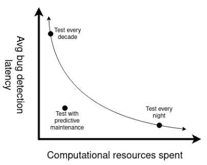

---
# See https://raw.githubusercontent.com/charmoniumQ/nix-documents/main/examples-src/markdown-bells-and-whistles/index.md
fail-if-warnings: yes
standalone: yes
dpi: 300
table-of-contents: no
citeproc: yes
cite-method: citeproc # or natbib or biblatex
bibliography: main.bib
link-citations: yes # in-text citation -> biblio entry
link-bibliography: yes # URLs in biblio
notes-after-punctuation: yes

title: Identifying and mitigating software collapse computational science
author:
- Samuel Grayson, Department of Computer Science <grayson5@illinois.edu>
- Daniel S. Katz, NCSA <dskatz@illinois.edu>
- Darko Marniov, Department of Computer Science <marinov@illinois.edu>
- Reed Milewicz, Sandia National Laboratories <rmilewi@sandia.gov>
number-sections: no

indent: no
pagestyle: plain
papersize: letter

colorlinks: yes
linkcolor: blue
---

# Abstract

_I will write this last._

# Introduction

More than half of scientists surveyed fields develop software for their research [@hettrick_softwaresavedsoftware_in_research_survey_2014_2018].
Unfortunately, the code they develop tends to break over time, even if it is unchanged, due to non-obvious changes in the computational environment.
This phenomenon is called "software collapse" [@hinsen_dealing_2019], because software with an unstable foundation is analagous to a building with unstable foundation.

If computational experiments are allowed to collapse, scientists cannot independently verify or build on those results.
Software collapse is a technical factor which contributes to the ongoing reproducibility crisis in computational science [@collberg_repeatability_2016].
Thus, software collapse undermines two fundamental norms of science identified by Merton, organized skepticism and communalism [@merton_sociology_1974].
Wide-spread irreproducibility hinders science's credibility [@ioannidis_why_2005].

Part of the problem is technical: people who want their software to be reliable do not necessarily know how to achieve that, given their resource constraints.
We suggest a technical solution, which should be a part of a holistic solution.

_TODO: Summarize Hinsen_

Zhao et al. studied software collapse computational experiments deposited in the myExperiment registry [@zhao_why_2012].
They find 80% of the experiments in their selection did not work, for a variety of causes: change of third-party resources, unavailable example data, insufficient execution environment, and insufficient metadata.
Of which, change of third-party resources causes the most failures.
This would include a step in the experiment that references data from another server which is no longer available.

Some authors prefer to run experiments inside a container, such as Docker, or virtual machine to improve their reproducibility.
However, Docker cannot provide reproducibility when the application itself requires third-party resources.
Zhao et al. showed that this is the most common cause of software collapse as well.
This is empirically validated, as Henkel et al. find 25% of Dockerfiles in their already limited sample still build.

_TODO: Summarize Sumatra and CDE_

# Methods

We want to collect data on software collapse of computational experiments by automatically running computational experiments from public registries.
These registries include:

- [nf-core](https://nf-co.re/): _TODO: describe each of these (one sentence)._
- [Dockstore](https://dockstore.org/)
- [Snakemake Catalog](https://snakemake.github.io/snakemake-workflow-catalog/)
- [WorkflowHub](https://workflowhub.eu/)
- [myExperiment](https://www.myexperiment.org/)
- Sandia's internal repository

We cannot take one computational experiment and simulate it one, five, and ten years into the future.
Instead, we will look for historical revisions of an experiment from one, five, or ten years ago and simulate it today.
All of the registries above store historical revisions of the workflow.
We make a _time symmetry_ assumption: historical rates of change will be similar to the future rate of change.
It is likely that some will still work and some sill fail, due to software collapse.

In summary: for each experiment registry, for each experiment in that registry, for each revision of that experiment, we will execute that revision at least twice.
For each execution, We will store the date of the revision's publication, the time of execution (i.e. today or very soon), compute resources expended in execution, logs, outputs and whether the execution terminated successfully.
We will analyze it as described in the next section and publish the raw data for other researchers.

# Analysis

We will replicate the quantities described by Zhao et al. [@zhao_why_2012] to see if these are changed: proportion of broken experiments, and proportion of breakages due to each reason (volatile third-party resources, missing example data, missing execution environment, insufficient description).
To this, we add "reproducible results" as a new "level" of success, beyond merely not crashing.
We will also extend the failure classification of Zhao et al. by going into deeper subcategories.
We will extend the results of Zhao et al. by asking how the proportion of broken experiments changes with time.

One holistic mitigation to software collapse is continuous testing: every so often the experiment should be run to ensure it still works and still gives the same result.
One strategy is to test every experiment every X time, where X is the "period of testing" (daily, monthly, etc.).
However, we can improve on this strategy by using our dataset to predict the rate of collapse of various computational experiments.
We will develop predictive models based on the staleness, properties of the code in the revision, and other determinants to predict the probability that a given experiment will fail.
Testing experiments prone to failure more often than reliable ones could save computational resources while maintining approximately the same degree of reliability in all experiments.
<!--
Note that a failure could indicate collapse, or it could indicate that the experiment never worked in the first place, possibly due to incomplete metadata.
-->

Once we know what kinds of failure are possible, we can also investigate automatic repair.
Our dataset will contain the output logs for each failure.
Therefore, we can apply similar techniques to Shipwright [@henkel_shipwright_2021], such as using a language model to categorize a large number of failures into a small number of clusters.

We can also use your model to identify best practices, by seeing if they correlate to an empirically lower failure rate.
We will use a "Bayes net" to test for confounding causal variables.
We will operationalize a set of reproducibility metrics based on existing literature and compare them to established software quality measures and their evolution over time for a small set of exemplar software projects; this work will leverage tools our team has developed for repository mining at scale.

<!--
This model will allow us to develop systems that efficiently detect collapse, develop repair techniques, and identify best practices.
One of them might be the choice of workflow engine; perhaps some engines have stronger reproducibility guarantees.

We hypothesize that lower software quality can lead to greater instability in software behavior and this ultimately harms reproducibility (e.g., more intervals of irreproducibility due to broken builds , poorly managed dependencies leading to flaky results , or poor test coverage concealing divergent behaviors).
If successful, our preliminary work will provide us with a tested ensemble of reproducibility metrics and suggest quality measures that may be aligned with those metrics.
-->

## Threats to Validity

The time symmetry assumption may not hold.
With all of the contemporary focus and effort around reproducibility, future rates of change may be markedly less than past rates of change.
While our computed rates of change will be understimates, those underestimates can still be useful as bounds.
Our method will also be useful, unchanged, for future studies.

_TODO: non-representative sample_

_TODO: other threats to validity._

# Future work

One way to combat software collapse is continuous testing.
An automated system can periodically check that the experiment returns the same result.
The period should be determiend carefully, because it trades off computational resources with the latency of finding bugs.
In order to make informed decisions, one would need to predict the rate of collapse for software; one needs to test more frequently if the collapse rate is higher.
Our model of empirically failures as a function of staleness and other determinants can inform this choice.
Then the system will direct its resources to the computational experiments that are most likely to fail.

<!--
In a large private firm or national lab, scientists create simulations to validate engineering design decisions.
Future design decisions in future problems might bear similarity to those previous ones, so scientists might try to reuse those computational experiments.
New evidence may arise that causes scientists to re-evaluate their conclusions.
In either case, scientists will need to repeat old computational experiments, so the durability of those experiments is crucial
The owning institution could create a continuous testing system

Use-case: national lab

Use-case: academia
-->

<!--
A workflow is a set of data transformations and dataflow linkages between them [@gil_examining_2007].
Workflows languages are often less complex than programming languages and easier for scientists to write and maintain.
Workflow registries contain hundreds of examples of computational experiments in a way that is suited for automatic execution.
-->

# Prior work

Zhao et al. studied the reliability workflows uploaded to the myExperiment registry, finding that 80% were not working [@zhao_why_2012].
Since then, a new generation of workflow engines have emphasized reproducibility, often running each node inside a container, so it would be interesting to reproduce Zhao's study on a modern workflow repository.
Zhao et al. only classifies their failures into four categories: volatile third-party resources, missing example data, missing execution environment, and insufficient description about workflows.
We would like to use more categories, for example, is the third-party resource a software dependency or data dependency?
We would also regress test failures on staleness, which Zhao does not attempt.

## Appendix A: Description of codes

We developed [a Python package](https:/github.com/charmoniumQ/wf-reg-test/) that finds and tests workflows.
This package depends on [Nix](https://nixos.org/) and [Docker](https://www.docker.com/) on the host system.
From Nix and Docker, the package can create software environments for each workflow engine of interest.
We have yet to parallelize the application, but we think this can be done easily using the parallel-map paradigm in [Dask](https://www.dask.org/).
The code is not done yet; namely, we need to implement scanning for more registries and more workflow engines.

## Appendix B: Experience, readiness, usage plans, and funding sources

We have experience with SLURM batch system, Dask programming, and related HPC technology.
Note that we need to develop more features and robustness in our code before we can run it on an HPC system.

## Appendix C: Resources required

5 registries, 100 workflows per registry, 10 revisions per workflow, 300 CPU seconds per workflow is a total of [^TODO: put in latest numbers and recompute.]

## Appendix D: Requested start date and duration

As soon as possible.

# References

::: {#refs}
:::
