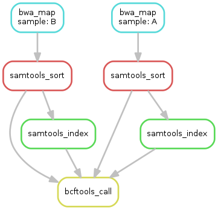

# How to keep computational experiments alive {style="font-size: 1.2em"}

[Samuel Grayson (Sandia, UIUC), Reed Milewicz (Sandia)]{style="font-size: 1.0em"}

## What is alive?

::: incremental
- (required) Run the experiment
- (would be nice) Results reproducible
  - Within statistical degree
:::

## Why long-term survivability?

::: incremental
- Parts last for decades
- Be engineers not archeologists
- Provenance: how did we get here
- Rerun: updated knowledge or methods
- Extend: new questions
:::

# Methods

## Open source samples

::: incremental
- Snakemake and Nextflow workflows
- Workflows nodes are container + cmd, edges are files
  - 
- One minute to half an hour
:::

# Results

## How many workflows? How many still alive?

| Quantity                                        | All              | Snakemake        | Nextflow         |
|-------------------------------------------------|------------------|------------------|------------------|
| \# workflows                                    | 101              | 53               | 48               |
| % of workflows with &ge; 1 non-crashing release | [53%]{.fragment} | [23%]{.fragment} | [88%]{.fragment} |
|                                                 |                  |                  |                  |
| \# releases                                     | 584              | 333              | 251              |
| % of releases with no crash                     | [28%]{.fragment} | [11%]{.fragment} | [51%]{.fragment} |

## What are common error causes

::: incremental
- Timeout
- Network resource changed
- Missing software dependency
- Missing data/config input
- Singularity error
- Conda environment unsolvable
- Unclassified
:::

## Results

| Kind of crash                | All   | Snakemake | Nextflow |
|------------------------------|-------|-----------|----------|
| Missing data/config input    | 32.2% | 43.8%     | 16.7%    |
| Conda environment unsolvable | 10.8% | 18.9%     | 0.0%     |
| Unclassified reason          | 7.9%  | 12.0%     | 2.4%     |
| Timeout reached              | 7.0%  | 5.7%      | 8.8%     |
| Singularity error            | 6.0%  | 6.6%      | 5.2%     |
| Other (workflow script)      | 5.7%  | 1.5%      | 11.2%    |
| Other (workflow task)        | 1.2%  | 0.0%      | 2.8%     |
| Network resource changed     | 0.7%  | 0.0%      | 1.6%     |
| Missing software dependency  | 0.5%  | 0.9%      | 0.0%     |
|                              |       |           |          |
| No crash                     | 28.1% | 10.5%     | 51.4%    |
|                              |       |           |          |
| Total                        | 100%  | 100%      | 100%     |

---

# Discussion

## Missing example data is prominent

::: incremental
- Experimenters should include example data (downloaded or generated)
- This would allow these workflows to be tested by idiots
- But, default data can be confusing
:::

## Conda environment unsolvable

::: incremental
- Packages can get yoinked
  - [Spec](https://github.com/atrisovic/dataverse-r-study/blob/master/docker/Dockerfile) [Repo](https://anaconda.org/conda-forge/r/files)
- Conda has no lockfile; only specfile
  - If you have to use Conda, [Conda-lock](https://github.com/conda/conda-lock)
- Impossible to debug
  - [StackOverflow](https://stackoverflow.com/a/69137255/1078199)
  - If you have to use Conda, use Mamba frontend
:::

## Container infrastructure is difficult (images)
::: incremental
- Distribute container images or distribute container build files?
- Expensive to store (DockerHub)
  - Is this container safe to delete? Append-only
  - `apt install x y` and `apt install x z` no reuse
  - Flask baseimage, Numpy baseimage, what if I need both?
- Link rot -> registries are ephemeral
:::

## Container infrastructure is difficult (build files)

::: incremental
- Lose reproducibility benefits if each user has to build
  - `apt update` -> `apt install x` is not reproducible
- Need a reproducible package manager to do the build
- Workable solution here!
:::

## Source-level package managers

::: incremental
- Guix, Nix, Spack
- Source is less expensive to store (delta compress, multiarch)
  - Reuse for `install x==1.0` and `install x==2.0`
  - Guix links to Software Heritage
- Binary buildcache available (more secure)
- Build containers reproducibly
  - Software environment is a DAG not a chain!
:::

## CI for configuration errors

::: incremental
- Too slow to run in CI
- Scale down fidelity and size
- Rerun periodically, not just when code changes
- Store small artifacts
  - File read/write set and hash (ptrace)
:::

## CI for detect semantic errors

::: incremental
- Parameterize test fidelity and size
- Schedule scaled down test frequently, full fidelity test infrequently
- Write provenance data (DAG of inputs, intermediates, outputs)
  - Collect statistical summary
  - Interoperable with other tools (W3C PROV)
  - Prov diff
:::

## Failure prediction

::: incremental
- For each experiment, estimate probability of failure
- Probability of failure determines frequency of testing
- Factors:
  - History of that individual workflow
  - History of workflows in that language and ecosystem
  - If A fails and B has many same components, B might fail
:::

# Solutions

::: incremental
- Default example data (for idiots)
- Conda &rArr; Mamba + Conda-lock
- Source-level package managers build containers reproducibly
- Multi-scale CI
- Failure prediction (research)
:::
